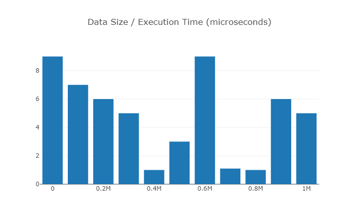
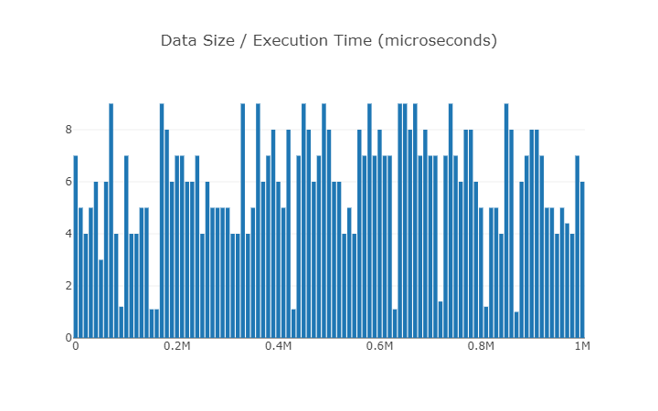
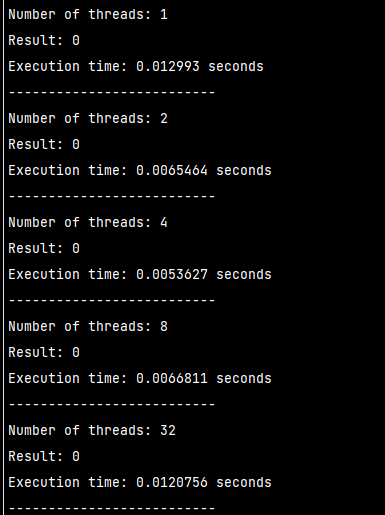
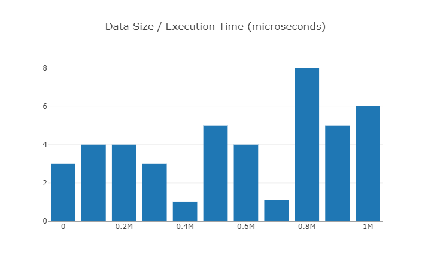
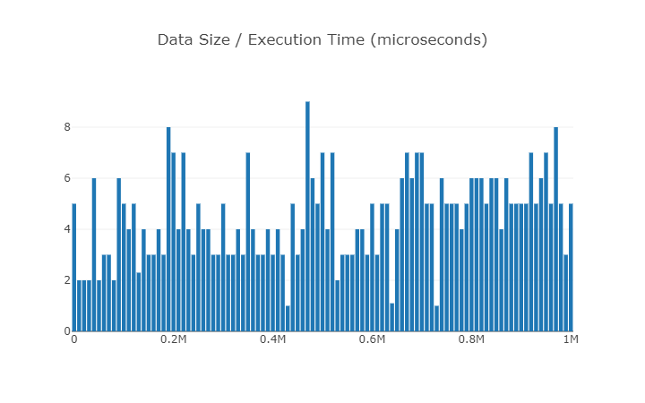
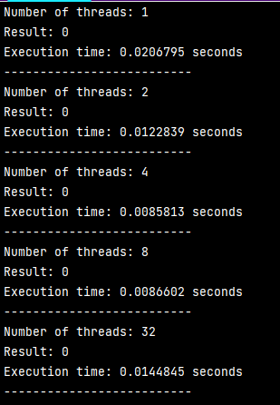

# Аналітика виконання алгоритму:
##  `Бібліотечний алгоритм:`
### Корок 1e+5 і 11 операцій маємо такий графік:

### Корок 1e+4 і 101 операція маємо такий графік:

### Кількість потоків:

##  `Поліфіл:`
### Корок 1e+5 і 11 операцій маємо такий графік:

### Корок 1e+4 і 101 операція маємо такий графік:

### Кількість потоків:

